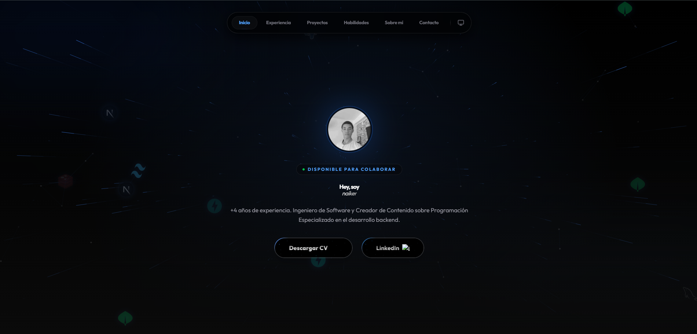

# 🚀 Portafolio Professional

<div align="center">
  
</div>

<br/>

## 📖 Descripción
Este proyecto es un portafolio web moderno y profesional diseñado para destacar habilidades técnicas y proyectos de desarrollo. Construido con las últimas tecnologías del ecosistema React, ofrece una experiencia de usuario fluida, animaciones dinámicas y un diseño totalmente responsivo. Ideal para ingenieros de software, desarrolladores full-stack y creadores de contenido técnico que buscan una presencia online impactante.

## 🛠️ Tecnologías Utilizadas
El proyecto utiliza un stack tecnológico de vanguardia para garantizar rendimiento y escalabilidad:

*   **Core**: [Next.js 16](https://nextjs.org/) (App Directory) & [React 19](https://react.dev/)
*   **Estilos**: [Tailwind CSS 4](https://tailwindcss.com/)
*   **Lenguaje**: [TypeScript](https://www.typescriptlang.org/)
*   **Animaciones**: [Framer Motion](https://www.framer.com/motion/) & Motion
*   **Iconos**: Lucide React
*   **Temas**: Next-themes (Dark/Light mode support)
*   **Utilidades**: clsx, tailwind-merge

## 📂 Estructura del Proyecto

La arquitectura del proyecto está organizada para ser intuitiva y escalable:

```bash
portafolio/
├── app/                # Rutas y lógica principal (Next.js App Router)
│   ├── assets/         # Recursos estáticos (imágenes como porfolio.png)
│   ├── globals.css     # Estilos globales y directivas de Tailwind
│   ├── layout.tsx      # Layout raíz de la aplicación
│   └── page.tsx        # Página de inicio
├── components/         # Biblioteca de componentes reutilizables
│   ├── ui/             # Componentes base de UI (botones, inputs, cards)
│   ├── Hero.tsx        # Sección de bienvenida y presentación
│   ├── Navbar.tsx      # Barra de navegación y control de temas
│   ├── Projects.tsx    # Galería de proyectos destacados
│   ├── Skills.tsx      # Visualización de habilidades técnicas
│   └── ...
├── public/             # Archivos estáticos accesibles públicamente
└── package.json        # Definición de dependencias y scripts
```

## 🚀 Instalación y Puesta en Marcha

Sigue estos pasos para desplegar el proyecto en tu entorno local:

1.  **Clonar el repositorio**
    ```bash
    git clone https://github.com/Naiker12/Portafolio-Clean-Code.git
    cd portafolio
    ```

2.  **Instalar dependencias**
    Asegúrate de tener Node.js instalado.
    ```bash
    npm install
    # o si usas yarn
    yarn install
    ```

3.  **Ejecutar servidor de desarrollo**
    ```bash
    npm run dev
    ```
    Abre [http://localhost:3000](http://localhost:3000) en tu navegador para ver la aplicación en funcionamiento.

## 🧩 Uso de Componentes

El desarrollo se basa en componentes modulares ubicados en la carpeta `components/`. 
- **Modificación**: Para editar una sección (ej. "Sobre Mí"), navega al archivo correspondiente (ej. `components/About.tsx`) y modifica el contenido JSX.
- **Estilos**: Usamos clases de utilidad de Tailwind CSS directamente en el JSX para un desarrollo rápido y consistente.
- **Iconos**: Importamos iconos de `lucide-react` para mantener una estética limpia y vectorial.

## � Scripts Disponibles

En el archivo `package.json` se definen los siguientes comandos útiles:

- `npm run dev`: Inicia el entorno de desarrollo local.
- `npm run build`: Compila la aplicación para producción.
- `npm run start`: Inicia el servidor de producción optimizado.
- `npm run lint`: Ejecuta el análisis estático de código (ESLint).
- `npm run deploy`: Script personalizado para automatizar el despliegue (Git add, commit y push).

## ✒️ Autor
**Naiker** - *Ingeniero de Software & Creador de Contenido*
<br/>
Construyendo el futuro con **Clean Code** y arquitecturas escalables.
