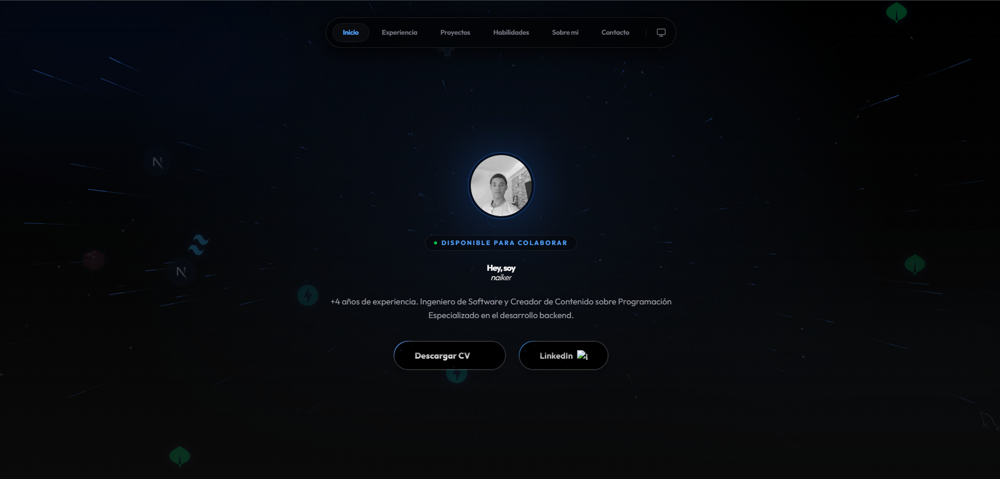

# Portafolio · Naiker OS

Portafolio de Naiker construido con Next.js 16, React 19, TypeScript y Tailwind CSS 4. La ruta principal presenta una bienvenida con acceso animado y un escritorio inspirado en Ubuntu.



## Organización

```text
app/                           Rutas, layout y estilos globales
features/portfolio/
  components/                  Secciones actuales del portafolio
  data/                        Experiencia, redes y tecnologías
  model/                       Tipos del contenido
features/session/              Bienvenida y acceso animado
features/desktop/              Escritorio, aplicaciones y reloj
features/projects/             Catálogo, tipos y galería de proyectos
features/window-manager/       Estado, marcos de ventana y Actividades
components/
  effects/                     Animaciones y componentes decorativos
  icons/                       Iconos de redes y categorías
  providers/                   Proveedor de tema
hooks/                         Hooks compartidos
lib/                           Utilidades y rutas de recursos
public/
  images/profile/              Fotos y vista previa
  images/                      Capturas de los siete proyectos
  icons/technologies/          SVG locales
  cv-naiker.pdf                CV descargable
docs/                          Inventario y arquitectura de Naiker OS
```

shadcn/ui está configurado en `components.json`. Su carpeta `components/ui` se creará al añadir las primeras primitivas. Lucide proporciona los iconos y Framer Motion las animaciones.

## Desarrollo

```bash
npm ci
npm run dev
```

Abre http://localhost:3000. Edita el contenido en `features/portfolio/data` y su presentación en `features/portfolio/components`.

## Validación y publicación

```bash
npm run lint
npm run typecheck
npm test
npm run build
```

El build de producción exporta el sitio a `out/` para GitHub Pages, con el prefijo `/Portafolio-Clean-Code`. En desarrollo los recursos usan la raíz `/`. Ambas decisiones se centralizan en `lib/assets.ts`.

El workflow `.github/workflows/deploy.yml` instala desde el lockfile, ejecuta lint, tipos y build y publica en GitHub Pages. El script heredado `npm run deploy` agrega, confirma y sube todos los cambios; no forma parte de la validación local.

## Plan de Naiker OS

- [Inventario antes de la reorganización](docs/estructura-actual.md)
- [Estructura organizada](docs/estructura-organizada.md)
- [Arquitectura y análisis de las nueve referencias](docs/arquitectura-naiker-os.md)
- [Cambios de la primera parte](docs/base-limpia.md)
- [Bienvenida y primer escritorio](docs/entrada-naiker-os.md)
- [Gestor de ventanas](docs/gestor-ventanas.md)
- [Perfil y explorador de proyectos](docs/explorador-proyectos.md)
