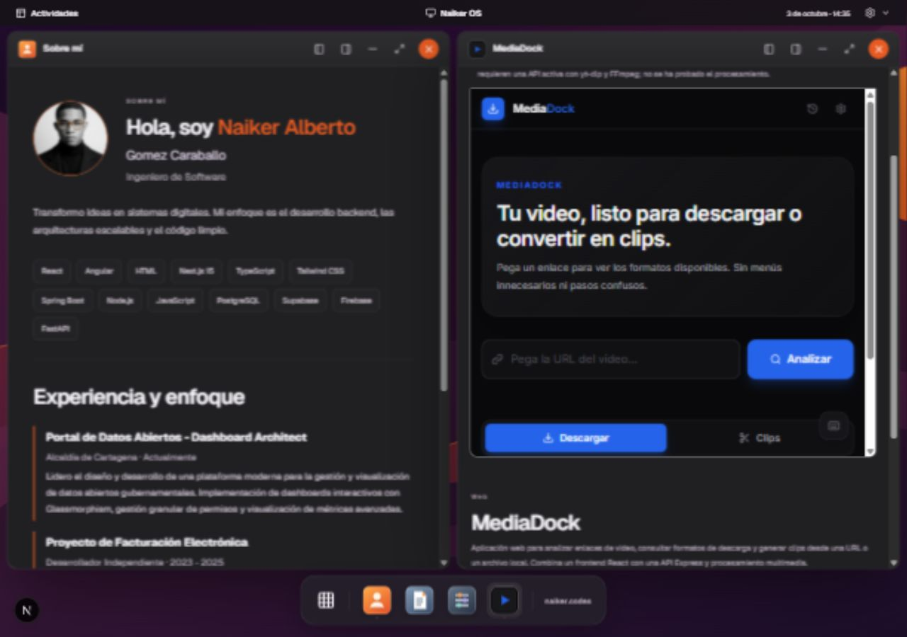
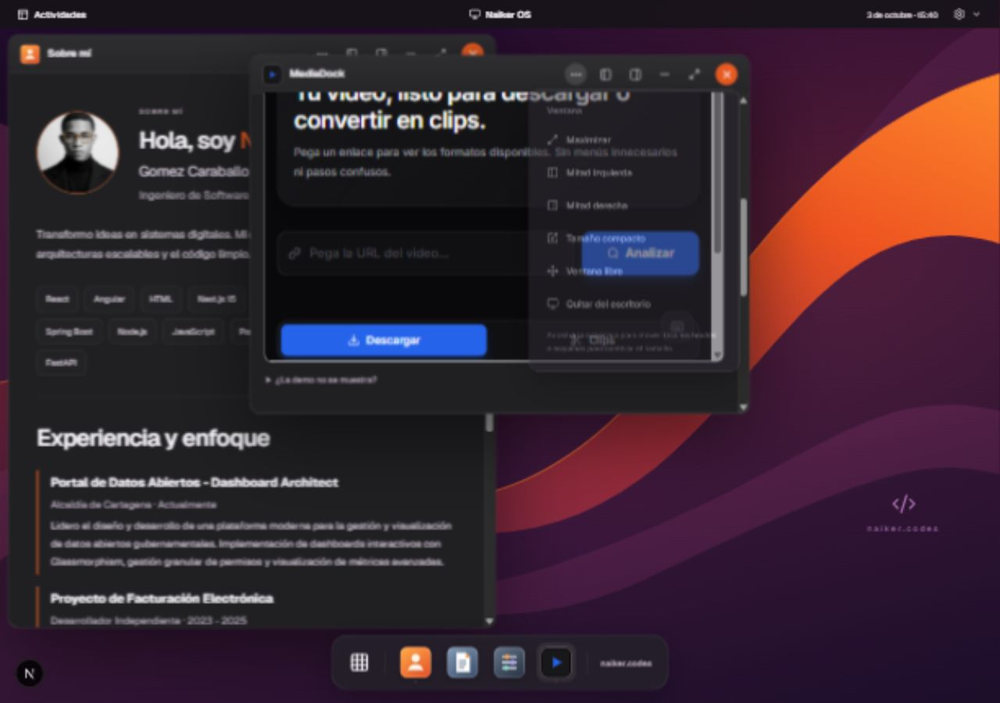
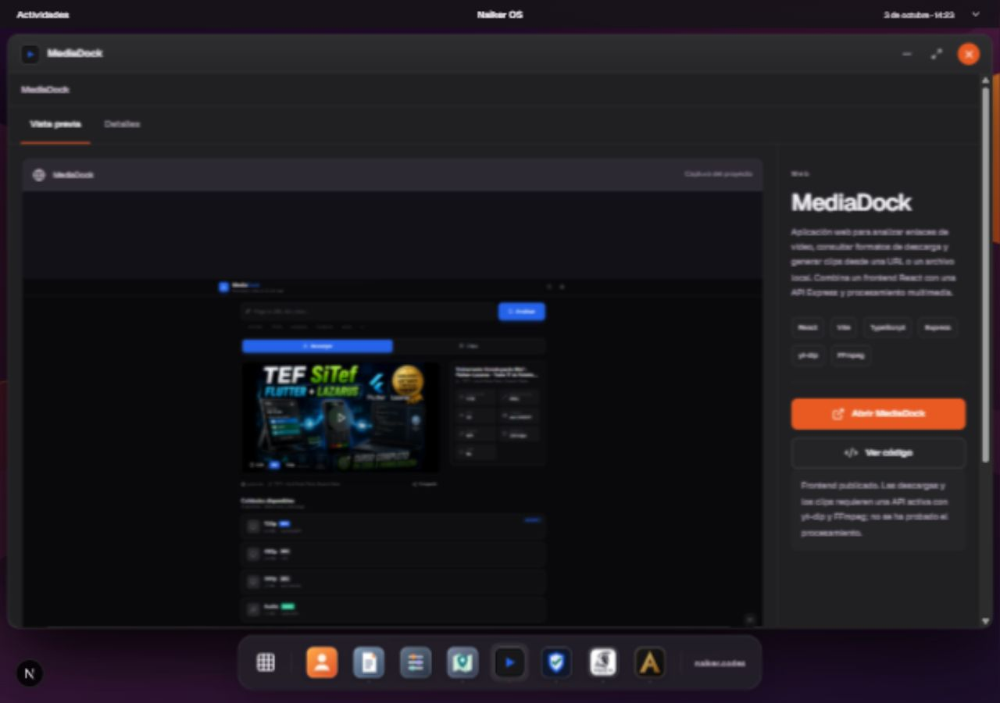

# Naiker OS · Portafolio

Portafolio de **Naiker Alberto Gomez Caraballo**, ingeniero de software enfocado en desarrollo backend, arquitecturas escalables y código limpio. Una experiencia web inspirada en Ubuntu: entra al escritorio y explora mi perfil, CV y proyectos como aplicaciones independientes.

**[Abrir el portafolio](https://naiker12.github.io/Portafolio-Clean-Code/)** · [Despliegues](https://github.com/Naiker12/Portafolio-Clean-Code/actions/workflows/deploy.yml)



## Funciones

- Bienvenida con reloj, foto y acceso animado de visitante.
- Lanzador con búsqueda y filtros Web, Móvil y Escritorio.
- Cada proyecto se abre como una aplicación: capturas, funciones, tecnologías, código y demo cuando está disponible.
- Ventanas que puedes mover, redimensionar, minimizar, maximizar y dividir.
- Accesos de aplicaciones que puedes añadir o quitar del escritorio.
- Visor de CV con páginas, zoom, ajuste al ancho y descarga del PDF.
- Personalización de tema, fondo, acento, dock y animaciones.
- Menú de sistema con bloqueo, cierre de sesión de visitante y reinicio del escritorio web.

La vista, las ventanas, su tamaño y los accesos se conservan al recargar **la misma pestaña**. Las preferencias de apariencia se guardan en el navegador. Bloquear conserva las ventanas; cerrar sesión o reiniciar las cierra y vuelve a la bienvenida.

## Capturas y controles

### Ventanas a tu medida

Arrastra la cabecera para mover una ventana y los bordes o esquinas para cambiar el tamaño. El menú **⋯** ofrece tamaño compacto, ventana libre, maximizar y colocar a izquierda o derecha. **Alt + ← / →** divide la ventana activa; doble clic en la cabecera maximiza o restaura.



En pantallas pequeñas las ventanas se adaptan al espacio disponible. Las transiciones son rápidas y respetan «Reducir animaciones».

### Aplicaciones y demos

«Vista previa» muestra las imágenes del proyecto, «Detalles» explica sus funciones y tecnologías, y «Abrir demo aquí» carga la web publicada. El navegador interno tiene recarga, indicador de carga y enlace externo para páginas que impiden ser incrustadas.



Estas imágenes son capturas de la implementación. El menú de ventana es la referencia más reciente para los controles de tamaño; las capturas anteriores de aplicaciones pueden mostrar controles previos.

## Proyectos

El catálogo contiene **12 proyectos**, además de perfil, CV y configuración:

| Aplicación | Presentación |
| --- | --- |
| GeoMaps | Inteligencia territorial; una ficha reúne frontend y backend. |
| MediaDock | Análisis de enlaces, formatos de descarga y generación de clips. |
| SentinelAI | Percepción visual, detecciones y eventos con dashboard local. |
| Sparta Agent | Agentes de IA, contexto de proyecto, terminal e integraciones MCP. |
| AUTEM | Plataforma inmobiliaria y visualización arquitectónica. |
| Sistema de Gestión Coca-Cola | Aplicación de gestión de escritorio. |
| Portal de Datos Abiertos | Gestión y visualización de datos públicos. |
| DragonBall - API | Exploración de personajes del universo DragonBall. |
| Call - Connect | Aplicación de comunicación. |
| Mercado Express | Aplicación de comercio electrónico. |
| Gallery - App | Galería de imágenes. |
| Tienda Virtual | Catálogo y experiencia de tienda web. |

La disponibilidad se indica en cada ficha. Los repositorios de GeoMaps devolvieron 404 sin autenticación durante la revisión; sus tecnologías y demo están pendientes de verificar. MediaDock tiene frontend publicado, pero las descargas y clips requieren su API. SentinelAI necesita sus servicios locales y no tiene demo pública verificada.

Consulta [la verificación de proyectos](docs/proyectos-verificados.md) y [las notas de GeoMaps, MediaDock y SentinelAI](docs/geomaps-mediadock-sentinel.md) para conocer las fuentes.

## Tecnologías

**Next.js 16 · React 19 · TypeScript · Tailwind CSS 4 · Lucide · Framer Motion · PDF.js**

El gestor de ventanas, la sesión y las preferencias están separados por funcionalidades. Se utilizan iconos originales de los repositorios cuando están disponibles y SVG propios para las demás aplicaciones. La configuración de shadcn/ui está en `components.json`.

## Ejecutar en local

Requiere **Node.js 24** y npm, igual que el workflow de publicación.

```bash
npm ci
npm run dev
```

Abre [localhost:3000](http://localhost:3000/). Antes de iniciar o compilar, `scripts/sync-pdf-assets.mjs` prepara el worker y los recursos de PDF.js desde la dependencia instalada. Estos archivos se generan automáticamente y no se versionan.

## Validar y publicar

```bash
npm run lint
npm run typecheck
npm test
npm run build
```

Las nueve pruebas actuales verifican el estado, recuperación, límites y tamaño de las ventanas. El build genera una exportación estática en `out/`. Para desarrollo utiliza `npm run dev`; `npm run start` no sirve esta exportación estática.

Un push a `main` inicia [el workflow de GitHub Pages](.github/workflows/deploy.yml): instala desde el lockfile, ejecuta lint, TypeScript, build y pruebas, y publica el sitio. También puedes iniciarlo manualmente desde Actions.

El prefijo de producción `/Portafolio-Clean-Code` y las rutas de recursos se centralizan en `lib/assets.ts`. En desarrollo se utiliza la raíz `/`.

## Dónde editar

| Cambio | Ubicación |
| --- | --- |
| Nombre y perfil | `features/portfolio/data/profile.ts` |
| Experiencia, tecnologías y redes | `features/portfolio/data/` |
| Proyectos, capturas, demos y repositorios | `features/projects/data/catalog.ts` |
| Iconos de aplicaciones | `features/desktop/components/application-icon.tsx` |
| Bienvenida | `features/session/` |
| Escritorio, lanzador y dock | `features/desktop/` |
| Ventanas y recuperación | `features/window-manager/` |
| Personalización | `features/preferences/` |
| Visor de CV | `features/cv/` |
| CV descargable | `public/cv-naiker.pdf` |

## Estructura

```text
app/                       Ruta principal, metadatos y estilos globales
features/
  session/                 Bienvenida y acceso de visitante
  desktop/                 Escritorio, aplicaciones, iconos y reloj
  window-manager/          Ventanas, geometría, Actividades y pruebas
  projects/                Catálogo, capturas y navegador de demos
  preferences/             Apariencia y accesibilidad
  cv/                      Visor PDF
  portfolio/               Datos personales y componentes de contenido
components/                Componentes compartidos, efectos y proveedores
hooks/                     Persistencia de la vista de esta pestaña
lib/                       Utilidades y rutas de recursos
public/                    Capturas, iconos, foto y CV
scripts/                   Preparación de recursos de PDF.js
docs/                      Capturas, decisiones y documentación
.github/workflows/         Validación y despliegue
```

## Referencias

- [Controles del escritorio](docs/controles-del-escritorio.md)
- [Personalización](docs/personalizacion.md)
- [Restauración de sesión](docs/restauracion-sesion.md)
- [Visor de CV y capturas](docs/visor-cv-capturas.md)
- [Aplicaciones independientes](docs/aplicaciones-independientes.md)
- [Arquitectura y referencias visuales originales](docs/arquitectura-naiker-os.md)

Naiker OS es un portafolio web. Sus controles de sesión y ventanas actúan sobre la página, sin modificar el sistema operativo del visitante.
